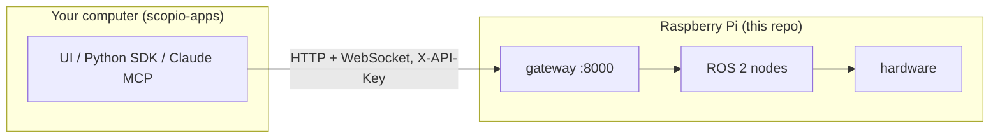

# SCOPIO

The Raspberry Pi side of a self-driving-lab microscope. It owns the hardware and exposes all of it through one authenticated HTTP/WebSocket API.

Built by Markiyan Konyk, Minho Kim and Jesus Valdes at The MatterLab (University of Toronto).

SCOPIO is the hardware layer of a self-driving-lab microscope, built on the OpenFlexure microscope, for a cryogenics lab. Every sensor and actuator is a ROS 2 node on a Raspberry Pi, always available behind one authenticated API. Any program, whether a UI, a script or an AI agent, can run experiments without touching the hardware code. New hardware capabilities get implemented as new nodes.

## Two repos, two machines

- **This repo** goes on the Raspberry Pi. It owns the hardware.
- **[scopio-apps](https://github.com/markiyan-konyk/scopio-apps)** goes on your computer. It holds the web UI, the Python SDK and the Claude MCP server.



## What it controls

- **Stage:** OpenFlexure XYZ stage on a Sangaboard (USB, or the v0.5 HAT on the GPIO header).
- **Camera:** the Raspberry Pi camera on the CSI port, as live MJPEG video plus controls.
- **Galvo mirrors:** two axes driven by a Rigol DG1022Z arbitrary-waveform generator.
- **Sample temperature:** a Wavelength Electronics TC10 LAB controller.
- **Laser:** switched on and off by a relay on GPIO17.

## Quick start

First time on this Pi? Do [INSTALL.md](INSTALL.md) first. It covers the one-time setup, including a boot setting that keeps the laser off at power-on.

On the Pi:

```bash
git clone https://github.com/markiyan-konyk/scopio.git
```

```bash
cd scopio/ros2_ws
```

```bash
mkdir -p data secrets
```

```bash
docker compose up -d --build
```

The first build takes a long time on a Pi, because it compiles the message definitions. Later builds take about a minute.

Make an API key on the Pi. Also `--list` and `--revoke <name>`:

```bash
python3 scripts/generate_api_key.py <name>
```

Check it on the Pi. `ros_ok` and `auth_configured` should both be `true`:

```bash
curl http://localhost:8000/api/v1/health
```

From a laptop, open `http://<pi-ip>:8000/docs` in a browser.

Now give the URL `http://<pi-ip>:8000` and the key to an app in [scopio-apps](https://github.com/markiyan-konyk/scopio-apps).

## Updating

On the Pi, in `scopio/ros2_ws`:

```bash
git pull
```

```bash
docker compose up -d --build
```

The containers run the code baked into the image, so any change to `src/` or `scripts/` needs `--build`. A change to `.env` needs only `docker compose up -d`. See [CONFIGURATION.md](docs/CONFIGURATION.md#what-a-change-costs).

## Docs map

| Doc | Read it when |
|---|---|
| [INSTALL.md](INSTALL.md) | You are setting up a Pi from a blank SD card. |
| [docs/ARCHITECTURE.md](docs/ARCHITECTURE.md) | You want to know how the pieces fit and why. |
| [docs/API.md](docs/API.md) | You are writing a client that talks to the gateway. |
| [docs/ADDING_A_NODE.md](docs/ADDING_A_NODE.md) | You are adding a device or a capability. |
| [docs/CONFIGURATION.md](docs/CONFIGURATION.md) | You want to change a setting, and need to know what the change costs. |
| [docs/TROUBLESHOOTING.md](docs/TROUBLESHOOTING.md) | Something does not work. |
| [docs/SECURITY.md](docs/SECURITY.md) | You are handing out keys or putting the Pi on a network. |
| [ros2_ws/README.md](ros2_ws/README.md) | You are building, running or developing the ROS 2 workspace. |
| [camera_server/README.md](camera_server/README.md) | You are working on the camera. |

## Known limitations

- The nodes enforce no range limits on the stage, the AWG or the temperature controller. Any key holder can drive the hardware anywhere. See [SECURITY.md](docs/SECURITY.md).
- The cause of the inverted laser relay (an active-low board, or wiring on the NC contact) is not yet confirmed on the rig. See [TROUBLESHOOTING.md](docs/TROUBLESHOOTING.md#laser-relay-is-inverted).
- The recent instrument changes (TC10 transport by kernel ownership, I/O pacing, galvo timing) are not yet validated on the hardware.
- The galvo settle times in scopio-apps are untuned guesses.
- The Python dependencies in the Dockerfile are not version-pinned yet. Pinning from a `pip freeze` on the Pi is planned.
