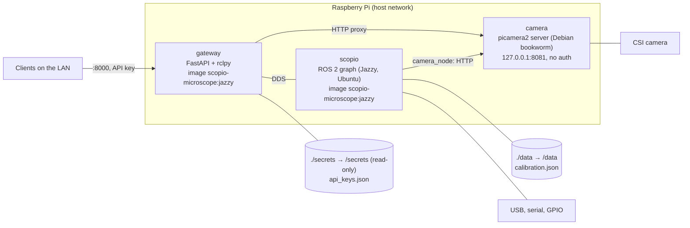
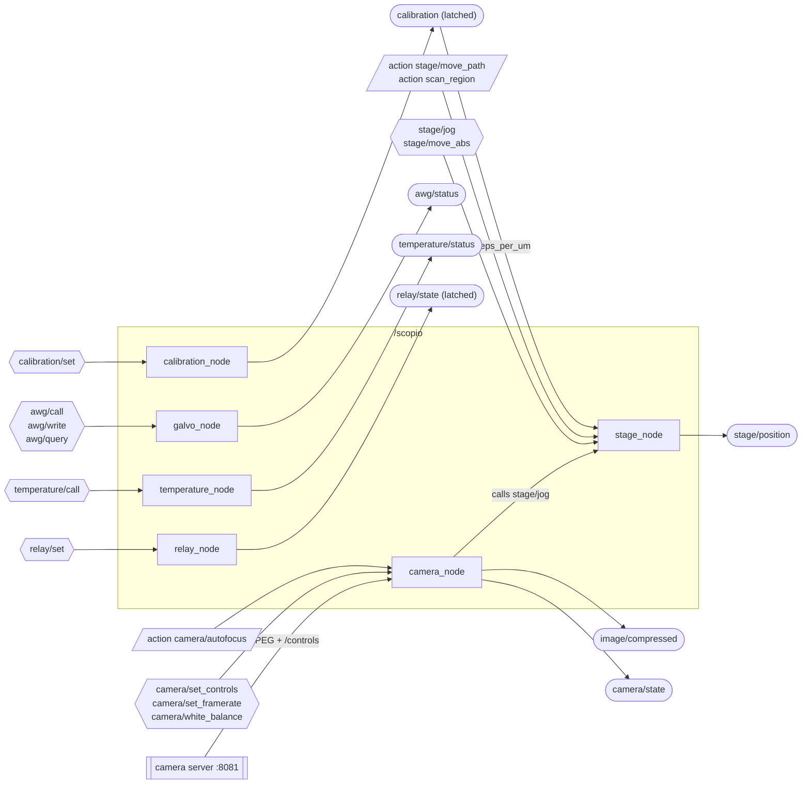

# Architecture

How SCOPIO is built, and why it is built that way.

## Principles

| Principle | Why |
|---|---|
| The Pi senses and acts. It never analyses or records frames. | Analysis and recording are client work, off the Pi. The Pi's CPU and SD card stay free for the hardware. |
| One node per device. | A device that fails or is missing takes down only its own node. |
| Every node runs without its hardware. It reports `connected=false` and keeps retrying. | The graph always comes up, so a missing instrument never hides the others. A device plugged in later is picked up without a restart. |
| The gateway is the only intended door to the network. | One place holds the API keys. Clients need no ROS, no Docker and no DDS. (See [SECURITY.md](SECURITY.md) for one gap in this.) |
| The surfaces are generic. Any service, topic or action is reachable, and an instrument node exposes its whole driver class. | Adding a capability means adding a node. The gateway, the SDK and the MCP need no change. |

## Containers

Three containers, defined in `ros2_ws/docker-compose.yml`, all with host networking and `restart: unless-stopped`.

- **`scopio`** runs every ROS 2 node from one launch file. It is privileged and bind-mounts the host's `/dev`, so instruments plugged in after start are visible. Its working directory is `/data`, which is `ros2_ws/data` on the Pi.
- **`camera`** is the only owner of the camera sensor. It serves MJPEG and the camera controls on loopback only, with no authentication.
- **`gateway`** is the public API on port 8000. It reuses the image the `scopio` service builds, and runs a different command.

**Why the camera is not inside ROS.** picamera2 and libcamera ship from Raspberry Pi OS (Debian), not from Ubuntu, so they cannot run in the Ubuntu-based ROS image. The camera gets its own Debian container, and `camera_node` is its client inside the graph. If libcamera fails in that container, the same server runs as a systemd unit on the host (see [camera_server/README.md](../camera_server/README.md#systemd-fallback)).

## The ROS graph

Everything lives under the `/scopio` namespace. Names below are relative to it.

| Node | Publishes | Services | Actions | Hardware |
|---|---|---|---|---|
| `camera_node` | `image/compressed`, `camera/state` | `camera/set_controls`, `camera/set_framerate`, `camera/white_balance` | `camera/autofocus` | the camera server |
| `stage_node` | `stage/position` | `stage/jog`, `stage/move_abs` | `stage/move_path`, `scan_region` | Sangaboard |
| `galvo_node` | `awg/status` | `awg/call`, `awg/write`, `awg/query` | | Rigol DG1022Z |
| `temperature_node` | `temperature/status` | `temperature/call` | | Wavelength TC10 LAB |
| `relay_node` | `relay/state` (latched) | `relay/set` (`std_srvs/SetBool`) | | GPIO17 |
| `calibration_node` | `calibration` (latched) | `calibration/set` | | `calibration.json` |

The gateway adds one more node, `/scopio/gateway`. Every node is described in [scopio_microscope/README.md](../ros2_ws/src/scopio_microscope/README.md). Every message type is in [scopio_interfaces/README.md](../ros2_ws/src/scopio_interfaces/README.md).

## The life of a request

**A jog over HTTP.** A client sends `POST /api/v1/service/stage/jog` with `{"dx": 100}` and an `X-API-Key` header.

1. The gateway checks the key against `secrets/api_keys.json`. A bad key gets a 401.
2. `ros_bridge` resolves `stage/jog` to `/scopio/stage/jog` and looks up its type in the live graph. An unknown name gets a 404.
3. The JSON becomes a `StageJog` request. A wrong field gets a 422. Missing integers default to 0. A missing float would become NaN (the NaN rule, see [API.md](API.md#the-nan-rule)).
4. The gateway calls the service and waits up to `?timeout=` seconds (default 10). No answer gets a 504.
5. `stage_node` moves the board, updates its open-loop position and replies `{success, message, x, y, z}`. The gateway returns that as JSON.

**A WebSocket subscription.** The client opens `/api/v1/ws?api_key=…` and sends `{"op": "subscribe", "id": "s1", "topic": "stage/position", "rate_hz": 10}`. The gateway creates a ROS subscription with the publisher's QoS, so a latched topic delivers its last value at once. Each message comes back as `{"op": "message", "id": "s1", …}`, thinned to `rate_hz`. Messages are dropped, never queued, if the client is slow.

**An action.** The client sends `{"op": "action_send_goal", "id": "g1", "action": "camera/autofocus", "goal": {…}}`. It receives `action_ack`, then a stream of `action_feedback`, then one `action_result` with `succeeded`, `aborted` or `canceled`. `{"op": "action_cancel", "id": "g1"}` cancels it. Closing the socket does **not** cancel the goal: it runs to the end.

**The video.** `GET /api/v1/stream.mjpg` passes the camera server's MJPEG bytes through unchanged, with no decode and no re-encode. Video never goes over the WebSocket or through ROS for clients. `camera_node` reads the stream only while something on the Pi needs frames (an `image/compressed` subscriber, or autofocus).

The full protocol is in [API.md](API.md).

## State that persists

| What | Where on the Pi | Written by |
|---|---|---|
| Calibration | `ros2_ws/data/calibration.json` | `calibration_node` |
| API keys | `ros2_ws/secrets/api_keys.json` | `scripts/generate_api_key.py` |
| Rig wiring | `ros2_ws/.env` | you |

Nothing else survives a restart. In particular, the stage position resets to zero whenever `stage_node` starts, and the galvo offsets reset to zero whenever `galvo_node` reconnects.

## Glossary

| Term | Meaning |
|---|---|
| Node | One process in the ROS 2 graph. Here, one per device. |
| Topic | A named stream of messages. Publishers send, subscribers receive, nobody replies. |
| Service | A named request and reply, for short commands. |
| Action | A long job with a goal, a stream of feedback, a result, and a cancel. |
| Latched topic | A topic published with TRANSIENT_LOCAL durability. A subscriber that joins late still gets the last message. |
| DDS | The network layer ROS 2 runs on. The gateway joins the graph through it. |

## Next

- [ADDING_A_NODE.md](ADDING_A_NODE.md): extend the graph
- [API.md](API.md): the client protocol
- [ros2_ws/README.md](../ros2_ws/README.md): build and run the workspace
